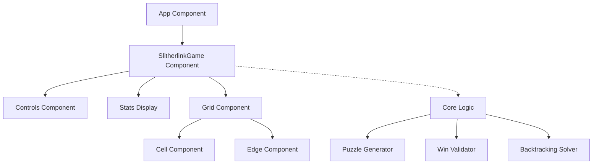

# Technical Design Document: Slitherlink Loop Game

## 1. High-Level Design (HLD)

### 1.1 System Overview
The Slitherlink Loop Game is a web-based puzzle game built using React and Vite. The objective is to draw a single continuous closed loop on a grid such that the number of edges around each cell matches the number inside that cell.

### 1.2 Architecture
The application follows a standard React component-based architecture with a clear separation between the UI layer and the core game logic.



### 1.3 Core Modules
- **UI Layer**: React components for rendering the grid, edges, and game controls.
- **Logic Layer**: Pure JavaScript/TypeScript functions for generating puzzles, validating moves, and checking win conditions.
- **State Management**: React `useState` and `useCallback` hooks for managing the game state, timer, and difficulty.

---

## 2. Low-Level Design (LLD)

### 2.1 Data Structures

#### `GridState`
The primary state object representing the game board.
```typescript
interface GridState {
  rows: number;
  cols: number;
  cells: (number | null)[][];
  horizontalEdges: EdgeState[][]; // (rows + 1) x cols
  verticalEdges: EdgeState[][];   // rows x (cols + 1)
}
```

#### `EdgeState`
Represents the state of a single edge.
- `0`: Empty
- `1`: Drawn (Part of the loop)
- `2`: X (Marked as impossible)

### 2.2 Algorithms

#### 2.2.1 Puzzle Generation
The generator uses an "Inside-Out" approach:
1. **Seed**: Select a random set of connected cells to be "inside" the loop.
2. **Boundary Extraction**: The loop is defined as the boundary between "inside" and "outside" cells.
3. **Constraint Derivation**: Calculate the number of drawn edges for each cell.
4. **Difficulty Scaling**: Remove a percentage of constraints based on the selected difficulty (Easy, Medium, Hard).

#### 2.2.2 Win Detection
The validator checks two primary conditions:
1. **Cell Constraints**: For every numbered cell, the count of adjacent edges with `state === 1` must match the cell's value.
2. **Loop Integrity**:
   - Every vertex must have a degree of either 0 or 2.
   - All drawn edges must be part of a single connected component (no multiple loops).

#### 2.2.3 Interaction Logic
- **Left Click**: Cycles through states: `Empty -> Drawn -> X -> Empty`.
- **Right Click**: Toggles between `Empty` and `X`.

### 2.3 Component Specifications

- **`SlitherlinkGame`**: The "Smart" component. Manages `GridState`, timer, and game status.
- **`Grid`**: Responsible for the absolute positioning of `Cell` and `Edge` components. Uses a coordinate system where dots are at `(r, c)` and cells are at `(r, c)` with edges in between.
- **`Edge`**: A specialized component that renders as a thin clickable area. It uses CSS pseudo-elements (`::after`) to show the actual line or 'X' mark, providing a larger hit area for better UX.

### 2.4 Styling Strategy
- **Theme**: Dark mode with high-contrast neon accents.
- **Animations**: CSS transitions for edge state changes and a pulse animation for the win state.
- **Responsiveness**: Flexbox and CSS Grid are used to ensure the game scales across different screen sizes.
